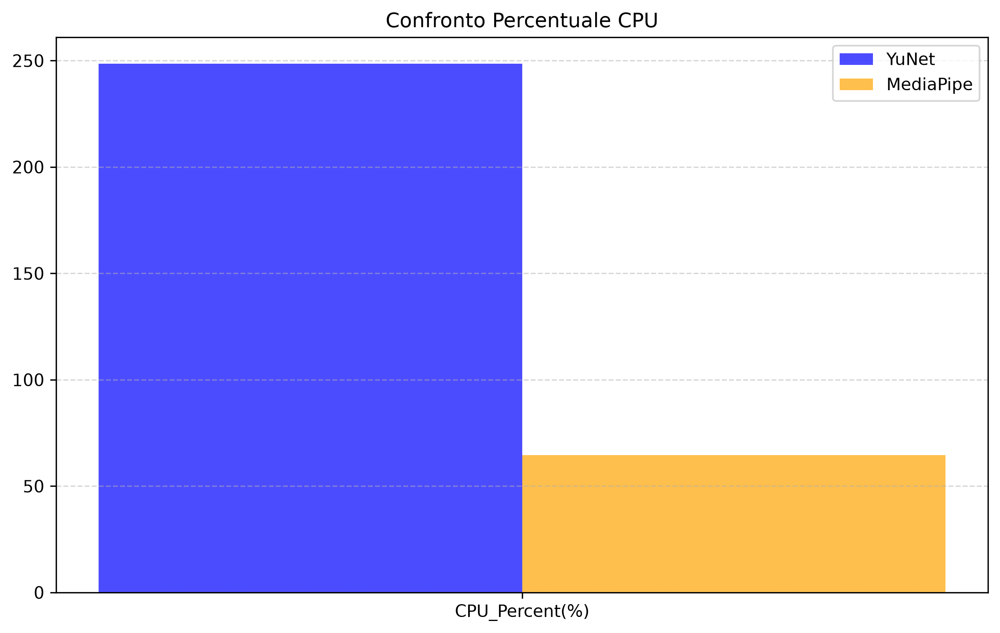
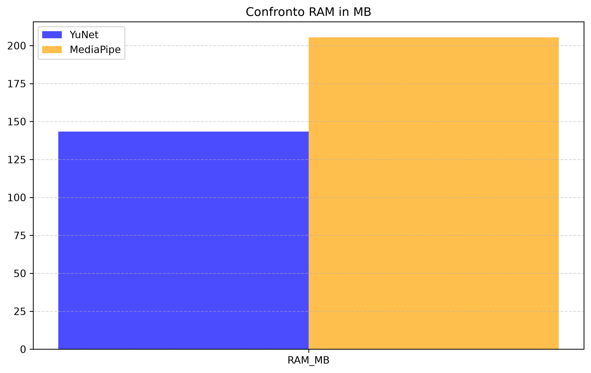
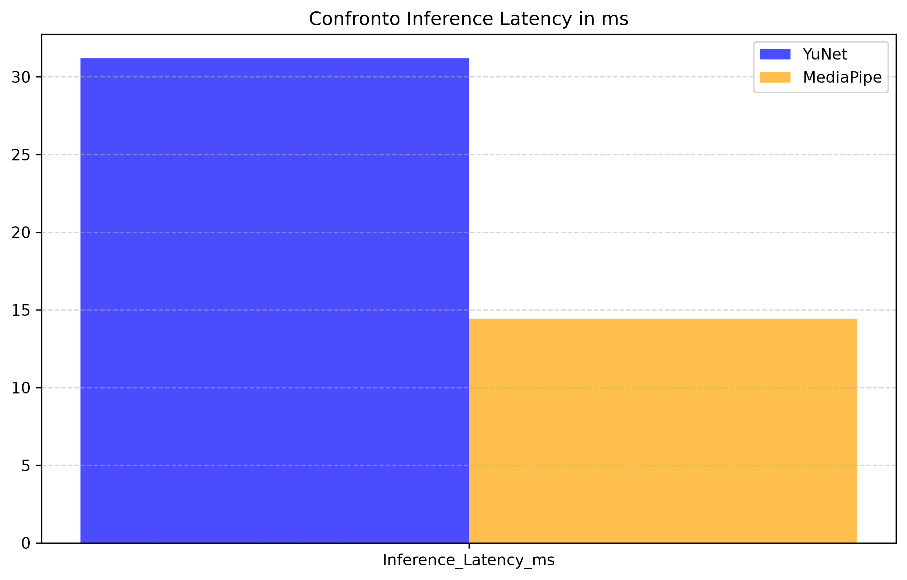
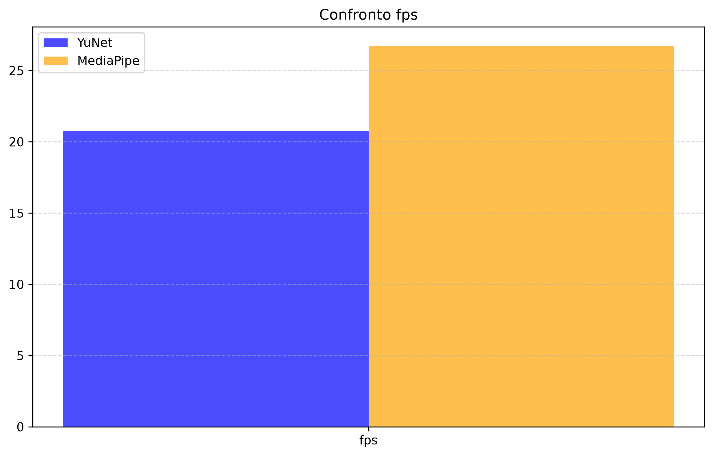
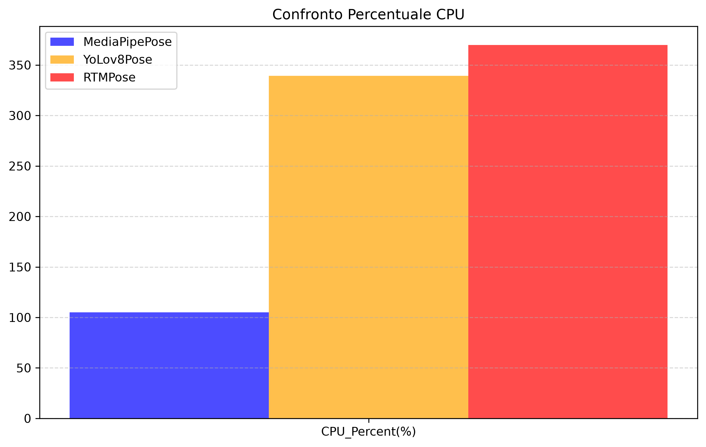
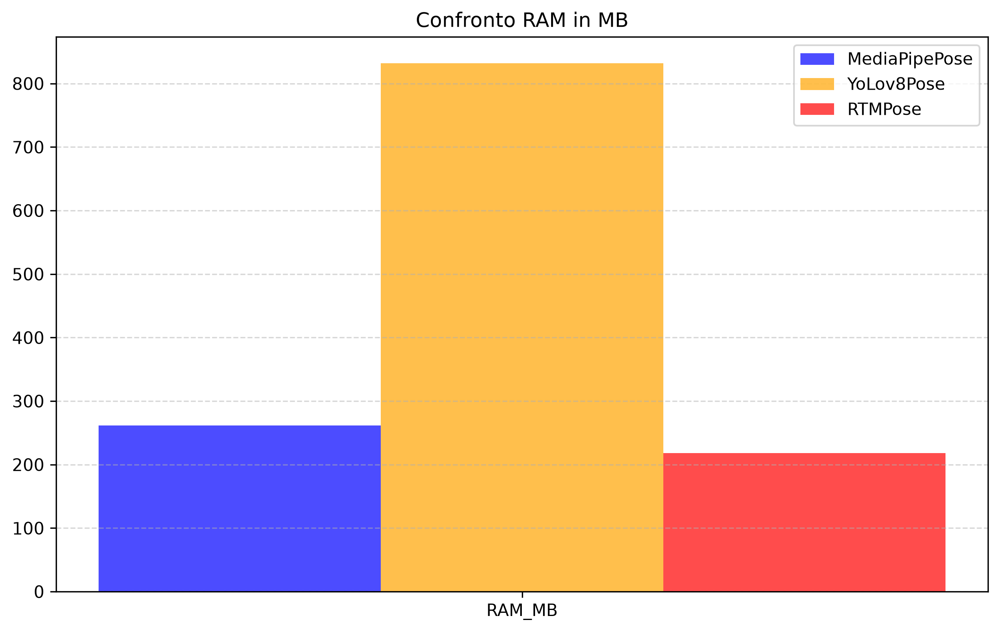
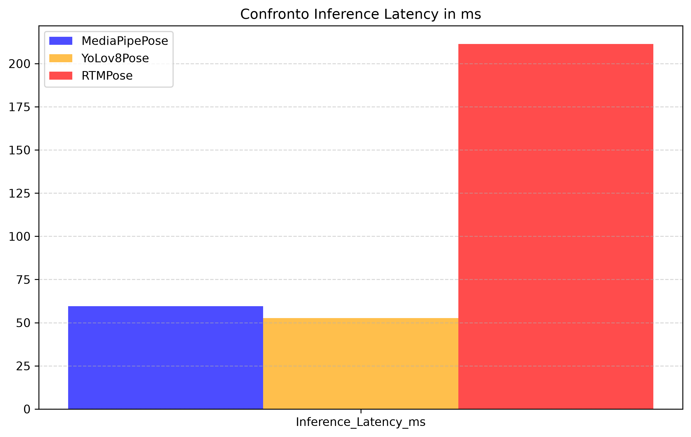
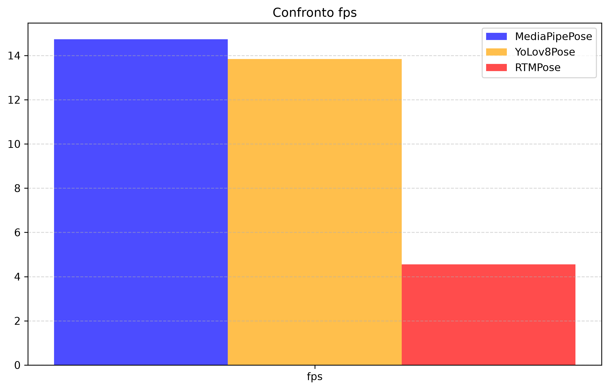

# FollowBot2

**FollowBot2** è la seconda versione di [FollowBot](https://github.com/Andrevi001/FollowBot). È un rover 2WD in grado di seguire una specifica persona ed eseguire comandi semplici tramite gesture. 

Le immagini vengono acquisite da una fotocamera collegata a una **Raspberry Pi 5** ed elaborate in locale tramite script **Python** che impiegano modelli **IA** ultra-leggeri dedicati. I dati di tracciamento e movimento calcolati dalla Pi 5 vengono inviati via **UART** a una scheda **ESP32**, che gestisce la cinematica e il controllo dei motori del robot.

---

## Tecnologie e componenti

- **Raspberry Pi 5** per la cattura ed elaborazione immagini
- **ESP32** per la gestione movimenti
- **2x Servo 180°** per il meccanismo pan/tilt
- **1x TB6612FNG** per il controllo dei motori
- **2x Motori DC** ridotti per la trazione 2WD
- **1x LM2596** per l'alimentazione "corpo"
- **1x DC-DC converter 5V 10A** per l'alimentazione PI 5 ed ESP32
- **4x Batterie 18650** per l'alimentazione del sistema
- **Software & Tools**: Python, C++, PlatformIO

---

## Upgrade rispetto a FollowBot

FollowBot è un rover che segue un volto muovendosi nello spazio e tenendosi a una distanza tra 120 cm e 170 cm dal bersaglio. L'elaborazione delle immagini è svolta da un server che riceve le immagini catturate dal rover restituendo i dati per il movimento. 

### Altri punti deboli di FollowBot1:
- Comportamento imprevedibile in presenza di più volti nel frame.
- Perdita definitiva del tracciamento quando il soggetto usciva dal campo visivo.
- Movimento a scatti del telaio per centrare il target quando il servo di Pan raggiungeva il fine corsa (rotazione improvvisa di 90°).

### Miglioramenti introdotti in FollowBot2:
- **Hardware**: L'integrazione della Raspberry Pi 5 a bordo elimina la dipendenza dal server esterno e dalla rete Wi-Fi, consentendo l'elaborazione in loco. I nuovi motoriduttori garantiscono un movimento più fluido.
- **Software**: Ottimizzazione del controllo cinematico.

### Novità:
- Riconoscimento facciale
- Tracking di spalle
- Gesture control

---

## Versioni

Le funzionalità proposte vengono sviluppate su più versioni.

### Versione 1.0:

In questa release il robot segue un volto rilevato all'interno del frame. 
Come in FollowBot questa versione ha un comportamento imprevedibile quando ci sono più volti.

Nel rover originale è stato impiegato YuNet per la rilevazione dei volti. In questa versione ho valutato l'utilizzo di un modello alternativo: MediaPipe/BlazeFace. Confrontando i due modelli teoricamente, dopo una taratura del voto di *confidence*, si hanno performance migliori.

#### Confronto Prestazioni Modelli (YuNet vs BlazeFace)

I dati sono rilevati tramite la classe **PerformanceTracker.py** e sono memorizzati in *Eye/ModelPerformance*.

| CPU Usage | RAM Usage |
| :---: | :---: |
|  |  |

| Inference Latency | FPS |
| :---: | :---: |
|  |  |

#### Considerazioni pratiche ed empiriche:

Nonostante le metriche favorevoli nei benchmark, i test sul campo evidenziano alcune limitazioni rispetto a YuNet:
- L'abbassamento della soglia di *confidence* ha introdotto falsi positivi (ombre o elementi dello sfondo scambiati per volti).
- A medie distanze (2-3 metri) il modello mostra un'accuratezza inferiore rispetto al rilevamento da vicino (< 1 metro).
- La costante per la stima della distanza era tarata sul bounding box di YuNet, risultando meno precisa con le proporzioni restituite da BlazeFace.

#### Calcolo della distanza:

Il rover si tiene tra i *100 cm* e i *160 cm* dal bersaglio. Per il calcolo della distanza si calcola l'area del *bounding box* del volto e la si divide per l'area del frame. Questo risultato poi viene posto sotto radice quadrata per stabilizzare i valori. Il valore ottenuto diventa poi il denominatore della divisione con *config.Kdistanza* per determinare la distanza. 

*config.Kdistanza* è la media delle rilevazioni memorizzate dentro *Eye/Distance/Face/Kdistance.txt*. Le rilevazioni sono state effettuate su più volti a una distanza di *100 cm* rispetto al punto di vista del rover.

Formula:
$$\hat{d} = \frac{K_{\text{distanza}}}{\sqrt{\frac{\text{Area}_{\text{bbox}}}{\text{Area}_{\text{frame}}}}}$$

### Versione 2.0:

In questa release il bersaglio del movimento del rover è un corpo. Questo permette di continuare il tracciamento anche quando il dato bersaglio è di spalle. Il comportamento rimane imprevedibile quando ci sono più bersagli nel frame.

Si introduce l'utilizzo del *multi threading* per velocizzare la pipeline. 
Ci sono 3 thread in totale:
- **Main Thread**: per la coordinazione, visualizzazione immagine e comunicazione seriale UART.
- **Camera Thread**: per la cattura immagine incorporato all'interno della classe **Camera**
- **TargetDetector Thread**: per l'inferenza IA, incorporato dentro la classe **TargetDetector**

Per rilevare la posa del corpo all'interno del frame viene impiegato un modello *IA* specializato. Per determinare quale modello utilizzare ho fatto un confronto tra MediaPipe Pose, YoLov8 Pose e RTMPose.

#### Confronto Prestazioni Modelli (MediaPipe Pose vs YoLov8 Pose vs RTMPose):

I dati sono rilevati tramite la classe **PerformanceTracker.py** e sono memorizzati in *Eye/ModelPerformance*.
Questi sono stati rilevati prima dell'introduzione del *multi threading*.

| CPU Usage | RAM Usage |
| :---: | :---: |
|  |  |

| Inference Latency | FPS |
| :---: | :---: |
|  |  |

#### Considerazioni pratiche ed empiriche:

Analizzando i grafici si vede che RTMPose non è il modello da impiegare in questa applicazione. Focalizzandosi sul confronto tra *MediaPipe Pose* e *YoLov8 pose* si vede che l'inferenza è leggermente più breve per *YoLov8*, anche se gli fps totali sono minori rispetto a *MediaPipe*. Il secondo confronto puo' essere attribuito all'attesa *I/O* della cattura del frame. 

Anche se la metrica principale è il tempo di inferenza ho deciso di utilizzare *MediaPipe Pose* perchè i valori leggermente ridotti di *YoLov8 Pose* non giustificano le prestazioni negli altri ambiti di confronto.

#### Calcolo della distanza:

Simile alla versione precedente, il rover si tiene alla distanza di *100 cm* e *160 cm* dal bersaglio.
Il calcolo della distanza viene effettuato rispetto a due costanti residenti nella classe **DistanceLogger**: Una è K_spalle, nel caso in cui siano visibili entrambe le spalle, l'altra è K_spalla_gomito, qualora non sia visibile una delle due spalle. 

Entrambe sono una media dei valori rilevati e memorizzati nei file *Eye/Distance/Pose/K_spalle.txt* e *Eye/Distance/Pose/K_spalla_gomito.txt*. 

Le rilevazioni sono fatte su bersagli diversi alla distanza di *100 cm*.
Uno dei due valori vine diviso per la diagonale del frame per ottenere una stima della distanza.

$$\hat{d} = \frac{K_{\text{utilizzata}} \cdot \sqrt{W^2 + H^2}}{d_{\text{pixel}}}$$

Dove:
- $d_{\text{pixel}}$ è la distanza euclidea in pixel tra le feature rilevate.
- $W, H$ sono larghezza e altezza del frame in pixel.
- $K_{\text{utilizzata}} \in \{K_{\text{spalle}}, K_{\text{spalla-gomito}}\}$ è la costante di calibrazione.
---

## Uso
1. Accendere il robot.
2. Il robot inizierà a rilevare il bersaglio e a muoversi in modo autonomo tenendosi tra **100 cm e 160 cm** dal bersaglio. Si comporta in modo imprevedibile nel caso in cui ci siano più persone nel frame

---

## REPO
- `/Body`: Codice C++ / PlatformIO per il controllo dei motori (ESP32).
- `/Eye`: Codice Python per la computer vision e la gestione della camera (Raspberry Pi 5).
- `/Eye/Modelli`: Modelli IA utilizzati per l'inferenza.
- `/Eye/ModelPerformance`: Benchmark e grafici sulle prestazioni dei modelli.
- `/Eye/Distance`: Rilevazioni per il calcolo della distanza.

---

## Licenza
Distribuito sotto licenza **MIT**. Vedi il file [`LICENSE`](LICENSE) per i dettagli.