# FollowBot2

**FollowBot2** is the second version of [FollowBot](https://github.com/Andrevi001/FollowBot). It is a 2WD rover capable of following a specific person and executing simple commands through gestures.

Images are captured by a camera connected to a **Raspberry Pi 5** and processed locally using **Python** scripts that employ dedicated, ultra-lightweight **AI** models. The tracking and movement data calculated by the Pi 5 are sent via **UART** to an **ESP32** board, which handles the robot’s kinematics and motor control.

---

## Technologies and Components

- **Raspberry Pi 5** for image capture and processing
- **ESP32** for movement control
- **2× 180° servos** for the pan/tilt mechanism
- **1× TB6612FNG** for motor control
- **2× DC gear motors** for the 2WD drivetrain
- **1× LM2596** to power the “body”
- **1× 5V 10A DC-DC converter** to power the Pi 5 and ESP32
- **4× 18650 batteries** to power the system
- **Software & Tools**: Python, C++, PlatformIO

---

## Upgrades over FollowBot

FollowBot is a rover that follows a face while moving around and maintaining a distance of 120–170 cm from the target. 
Image processing is performed by a server that receives the images captured by the rover and returns movement data.

### Other Limitations of FollowBot:

- Unpredictable behavior when multiple faces are present in the frame.
- Permanent loss of tracking when the subject left the field of view.
- Jerky chassis movement to center the target when the pan servo reached its travel limit, resulting in a sudden 90° turn.

### Improvements Introduced in FollowBot2:

- **Hardware**: Integrating the Raspberry Pi 5 onboard eliminates dependence on an external server and Wi-Fi network, enabling local processing. The new gear motors provide smoother movement.
- **Software**: Optimized kinematic control.

### New Features:

- Facial recognition
- Tracking people from behind
- Gesture control

---

## Versions

The proposed features are being developed across multiple versions.

### Version 1.0:

In this release, the robot follows a face detected within the frame.
As with FollowBot, this version behaves unpredictably when multiple faces are present.

The original rover used YuNet for face detection. In this version, I decided to try an alternative model: MediaPipe/BlazeFace. Comparing the two models showed better performance on paper after tuning the *confidence* threshold.

#### Model Performance Comparison (YuNet vs BlazeFace)

| CPU Usage | RAM Usage |
| :---: | :---: |
| 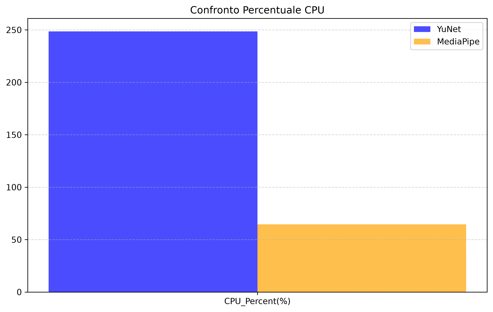 | 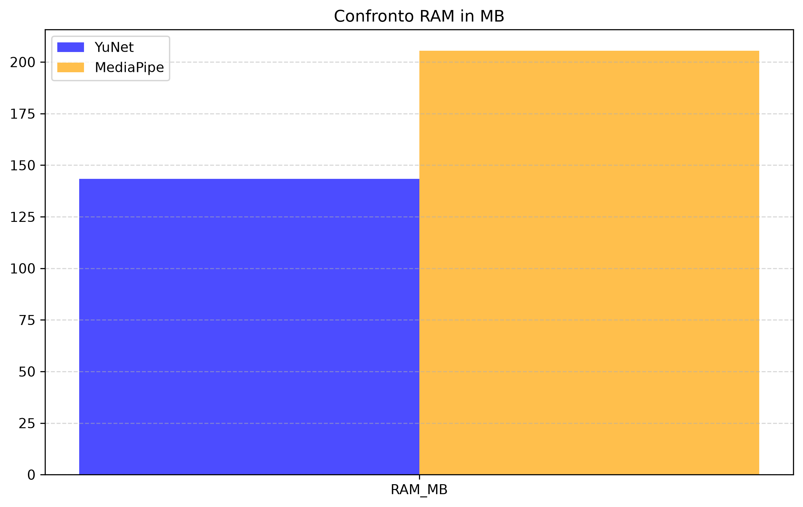 |

| Inference Latency | FPS |
| :---: | :---: |
| 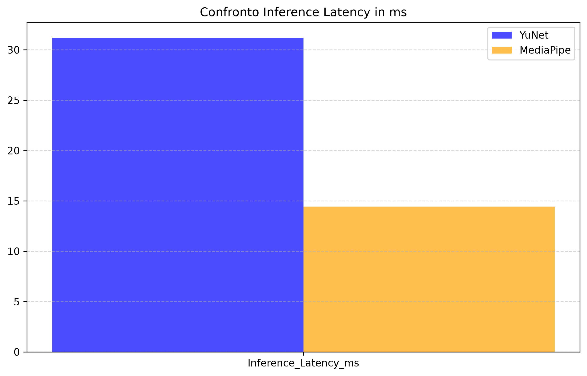 | 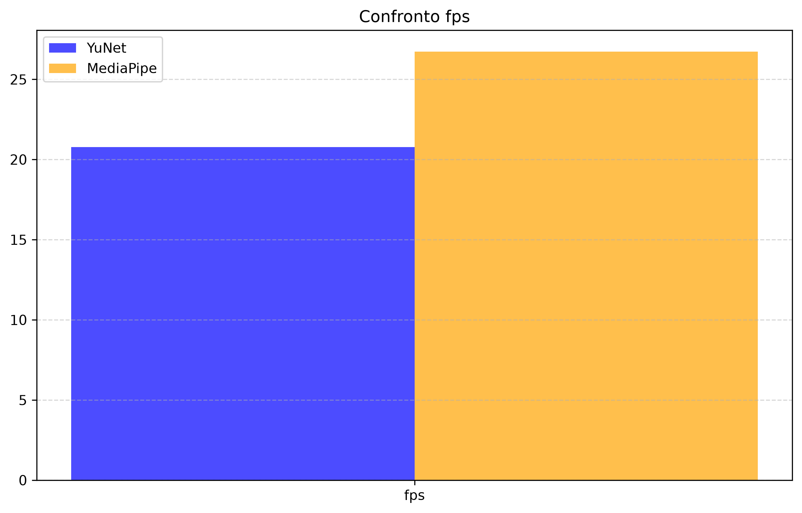 |

#### Practical and Empirical Observations:

Despite favorable benchmark metrics, field tests revealed some limitations compared to YuNet:

- Lowering the *confidence* threshold introduced false positives, such as shadows or background elements mistaken for faces.
- At medium distances (2–3 meters), the model is less accurate than at close range (< 1 meter).
- The distance estimation constant was calibrated using YuNet’s bounding box, making it less accurate with the proportions returned by BlazeFace.

### Version 2.0:

In this version, the rover follows a pose detected within the frame rather than a face.

Pose detection is handled by a specialized AI model. To select the model, I compared three models:
MediaPipe Pose, YOLOv8 Pose, and RTMPose. As the comparison below shows, MediaPipe Pose is the most adequate choice.

This version introduces **multithreading**. The threads are the main thread, a dedicated image capture thread, and a dedicated MediaPipe Pose inference thread. As shown in the comparison, integrating **multithreading** provides a slight improvement of approximately 5% over the non-threaded version, at the cost of higher CPU usage.

#### Model Performance Comparison (MediaPipe Pose vs YOLOv8 Pose vs RTMPose)

| CPU Usage | RAM Usage |
| :---: | :---: |
| 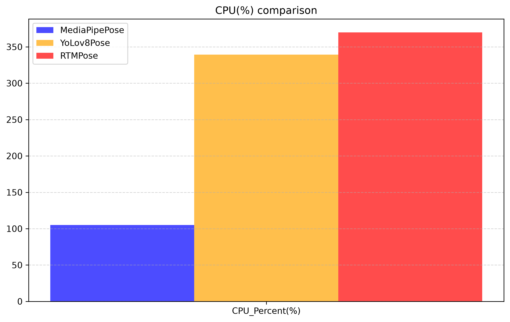 | 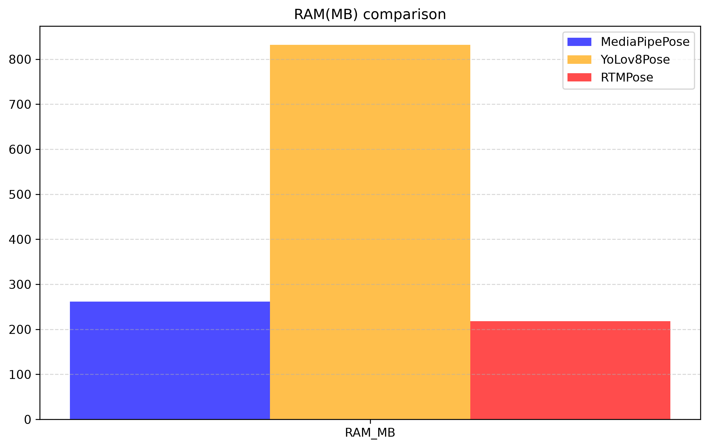 |

| Inference Latency | FPS |
| :---: | :---: |
| 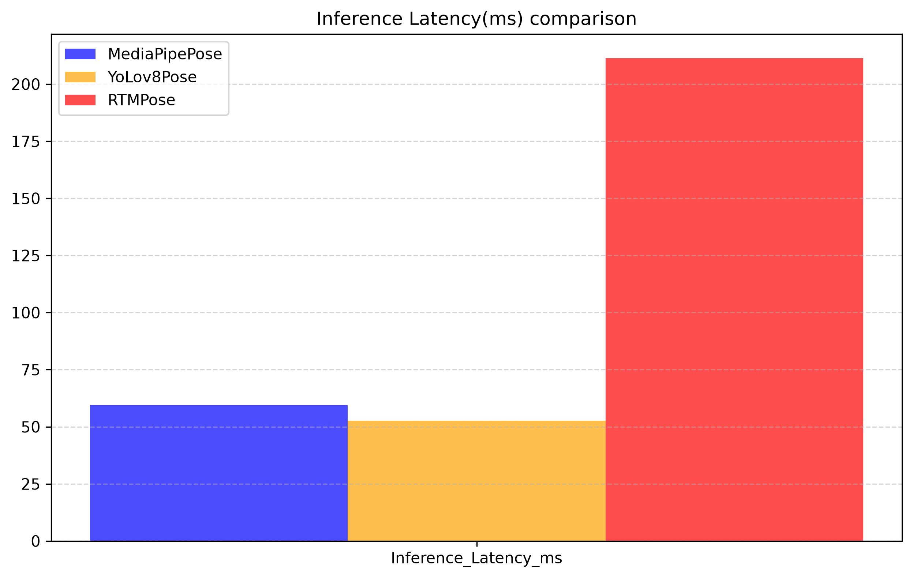 | 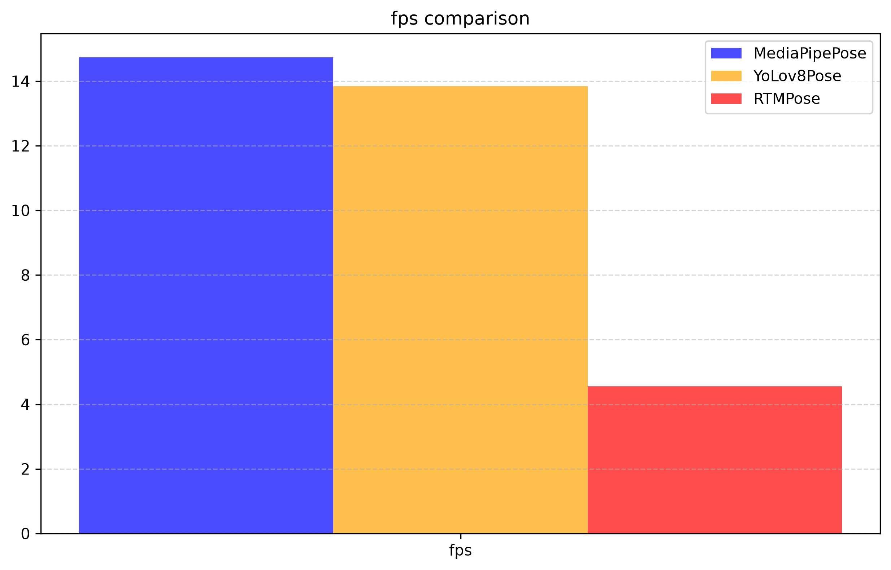 |

#### Threaded vs Non-Threaded Performance Comparison

| CPU Usage | RAM Usage |
| :---: | :---: |
| 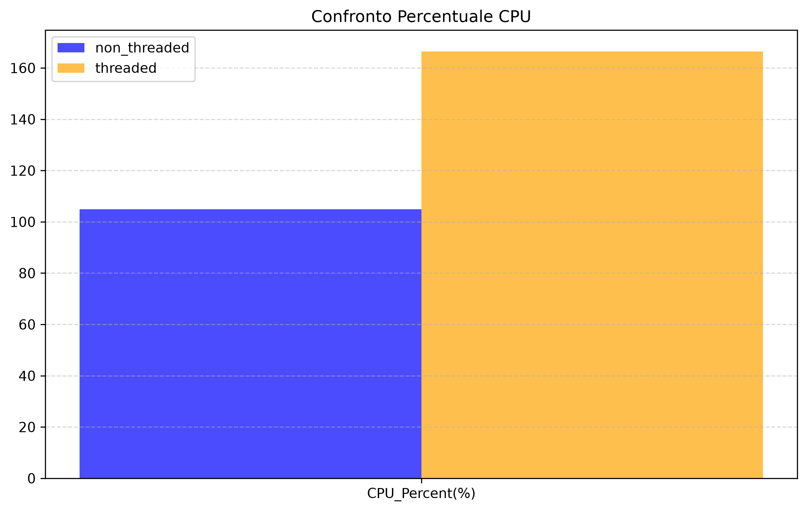 | 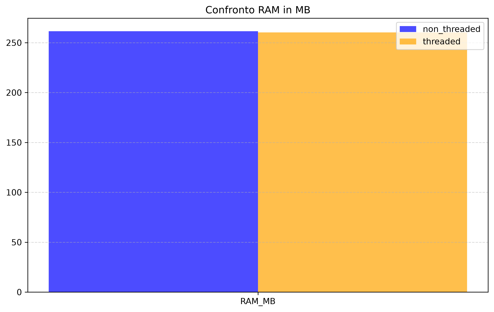 |

| FPS |
| :---: |
| 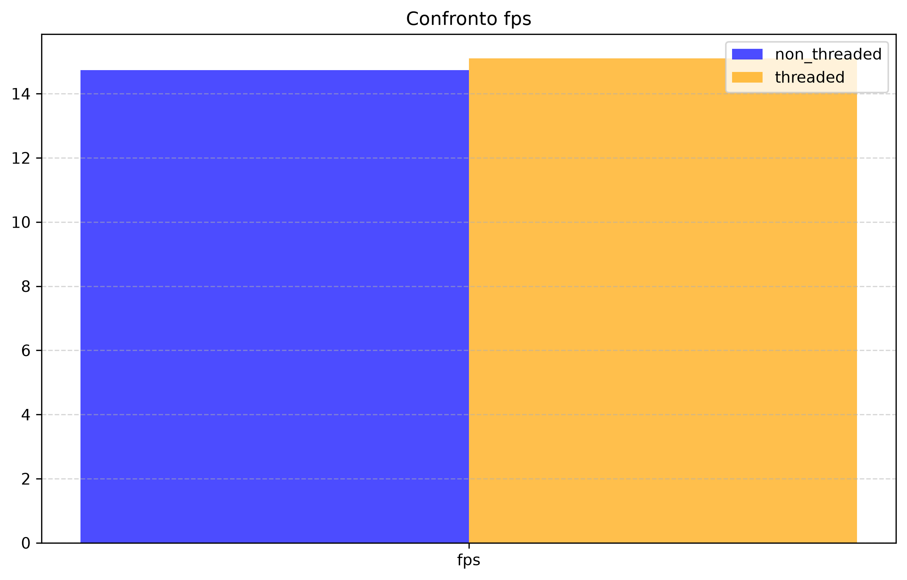 |

#### Practical and Empirical Observations:

Despite the limited performance improvement from integrating **multithreading**, repeatedly reusing the latest available pose results in smoother movement of the **pan/tilt** mechanism.

Distance estimation is based on measurements taken from multiple people at the same distance of **100 cm**. The measurement used is the distance between the shoulders. Using this measurement causes estimation errors when the target rotates. Furthermore, this measurement cannot be used when the target is in profile. To avoid these issues, the rover discards all measurements below a predefined threshold.

---

## Usage

1. Turn on the robot.
2. The robot will begin detecting the body and moving autonomously, attempting to maintain a distance of **100–160 cm** from the target.

---

## REPO

- `/Body`: C++ / PlatformIO code for motor control (ESP32).
- `/Eye`: Python code for computer vision and camera management (Raspberry Pi 5).
- `/Eye/Distance`: Measurements taken at **100 cm**, used to estimate the distance to the target.
- `/Eye/ModelPerformance`: Model performance benchmarks and graphs.
- `/Eye/Models`: AI models used for inference.

---

## License

Distributed under the **MIT** license. See the [`LICENSE`](LICENSE) file for details.